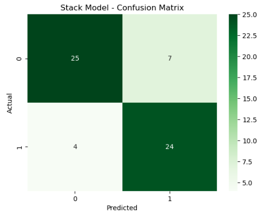

# Heart Disease Prediction using Machine Learning

## 📌 Overview  
This project implements a **stacking-based machine learning model** to predict the likelihood of heart disease using clinical features.  
The model combines multiple classifiers to improve prediction performance and reliability in healthcare classification tasks.

---

## 🎯 Key Features  

• Stacking-based ensemble learning approach  
• Uses clinical health indicators for prediction  
• Robust preprocessing and normalization  
• Confusion matrix visualization  
• Performance evaluation using accuracy, precision, recall, and F1-score  

---

## 🛠 Tech Stack  

• Python  
• Pandas, NumPy  
• Scikit-learn  
• Matplotlib, Seaborn  

---

## 📂 Dataset  

This project uses the **Cleveland Heart Disease dataset** containing clinical attributes such as age, chest pain type, cholesterol levels, and maximum heart rate.  
The dataset is included in the `data/` folder for reproducibility.

---

## 📂 Project Structure  

heart-disease-prediction/
│  
├── data/  
│   └── heart_cleveland_upload.csv  
│  
├── src/  
│   └── main.py  
│  
├── outputs/  
│   └── confusion_matrix.png  
│  
├── README.md  
├── requirements.txt  
└── LICENSE  

---

## ⚙️ How to Run  

### 1️⃣ Clone Repository  
git clone https://github.com/sahilwadhwaofficial-star/heart-disease-prediction  

### 2️⃣ Install Dependencies  
pip install -r requirements.txt  

### 3️⃣ Run Project  
python src/main.py  

---

## 📊 Results  

• Accuracy: **81.67%**  

The stacking-based machine learning model demonstrated reliable classification performance.  
High recall for heart disease cases highlights strong predictive capability in identifying at-risk patients.  
The balanced dataset contributed to stable and unbiased model training.

---

## 📊 Visual Results  

### 🔹 Confusion Matrix  

---

## ⚠️ Disclaimer  

This project is for educational and research purposes only.  
It is not intended for medical diagnosis or clinical use.

---

## 📄 License  
This project is licensed under the MIT License.
